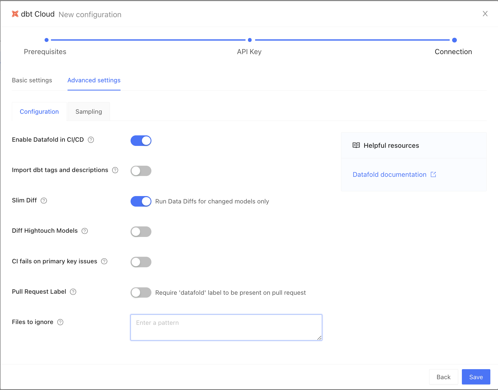

:::info
You will need a dbt **Team** account or higher to access the dbt Cloud API that Datafold uses to connect the accounts.
:::

## Prerequisites

### Set up dbt Cloud CI

In dbt Cloud, [set up dbt Cloud CI](https://docs.getdbt.com/docs/deploy/ci-jobs#set-up-ci-jobs) so that your Pull Request job runs when you open or update a Pull Request. This job will provide Datafold information about the changes included in the PR.

 

### Create an Artifacts Job in dbt Cloud

The Artifacts job generates production `manifest.json` on a scheduled basis, giving Datafold information about the state of production. The simplest method is to set up a dbt Cloud job that executes the `dbt ls` command on an hourly basis.

> Note: `dbt ls` is preferred over `dbt compile` as it runs faster and data diffing does not require fully compiled models to work.

Example dbt Cloud artifact job settings and successful run:

 
 

    
Continuous Deployment

    If you are interested in continuous deployment, you can use a <a href="/cd#merge-trigger-production-job">Merge Trigger Production Job</a> instead of the Artifacts Job listed above.

### dbt Cloud API Key
You will need either a [Service Token](https://docs.getdbt.com/docs/dbt-cloud-apis/service-tokens) or a [User Token](https://docs.getdbt.com/docs/dbt-cloud-apis/user-tokens) to connect Datafold to your dbt Cloud account.

- **Service Token (Recommended):** Navigate to **Account Settings &rarr; Service Tokens &rarr; + New Token** 
    

 

- Add a Permission Set and select `Member` or `Developer`
- Select `All Projects`, or check only the projects to use with Datafold
- Save 

- Navigate to **Your Profile &rarr; API Access** and copy the token.

## Create a dbt Cloud Integration in the Datafold app

- Navigate to Settings > Integrations > dbt Cloud/Core and create a new dbt Cloud integration.

- Enter the API Key (Service Token) you copied from dbt Cloud.

## Configuration

### Basic Settings

- **Repository**: Select a repository that you set up in [the Version Control setup step](/connections/code_repositories).
- **Data Source**: Select a data source that you set up in [the Data Sources setup step](/connections/databases).
- **Name**: This can be anything!
- **Primary key tag**: This is a text string that you may use to tag primary keys in your dbt project yaml. Note that to avoid the need for tagging, [primary keys can be inferred from dbt uniqueness tests](/deployment_testing/best_practices#primary-key-inference).
- **Account name**: This will be autofilled using your dbt API key.
- **Job that creates dbt artifacts**: This will be [the Artifacts Job that you created](#create-an-artifacts-job-in-dbt-cloud). Or, if you have a dbt job that runs on each merge to main, select that job.
- **Job that builds pull requests**: This is the dbt CI job that is triggered when you open a Pull Request or Merge Request.

### Advanced Settings

- **Enable Datafold in CI/CD**: High-level switch to turn Datafold off or on in CI (but we hope you'll leave it on!).
- **Import dbt tags and descriptions**: Populate our Lineage tool with dbt metadata. ⚠️ This feature is in development. ⚠️
- **Slim Diff**: Only diff modified models in CI, instead of all models. [Please read more about Slim Diff](/deployment_testing/performance_optimization/#slim-diff), which is highly configurable using dbt yaml, and each organization will need to set a strategy based on their data environment.
    - Downstream Hightouch models will be diffed even when Slim Diff is turned on.
- **Diff Hightouch Models**: Hightouch customers can see diffs of downstream Hightouch assets in Pull Requests.
- **CI fails on primary key issues**: The existence of null or duplicate primary keys causes the Datafold CI check to fail.
- **Pull Request Label**: For when you want Datafold to *only* run in CI when a label is manually applied in GitHub/GitLab.
- **Files to ignore**: If any files listed in this field are modified in the Pull Request, Datafold will not run in CI. 
    - If you want individual models to never be diffed, but don't want them to block Datafold from diffing other models in the PR, [check out our Never Diff dbt yaml config](/deployment_testing/configuration/model-specific_ci_configuration/#excluding-models).
    - If **Files to ignore** is defined, the files matching the pattern will be ignored in the PRs. The pattern uses the syntax of `.gitignore`. Excluded files can be re-included by using the negation; re-included files can be later re-excluded again to narrow down the filter. For example, to exclude everything except the `/dbt` folder, but not the dbt `.md` files, do:`*!dbt/*dbt/*.md`

Click save and that's it! 🎉 

Now that you've set up a dbt Cloud integration, Datafold will diff your impacted tables whenever you push commits to a PR. A summary of the diff will appear in GitHub, and detailed results will appear in the Datafold app.