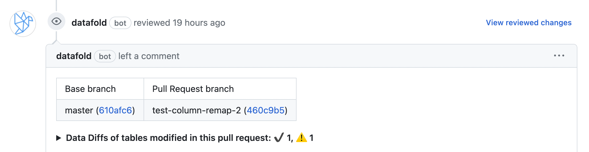
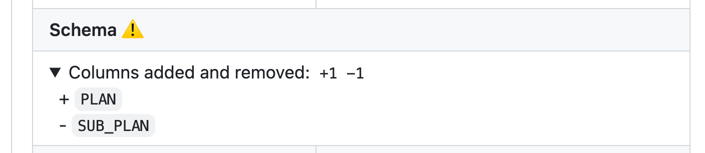
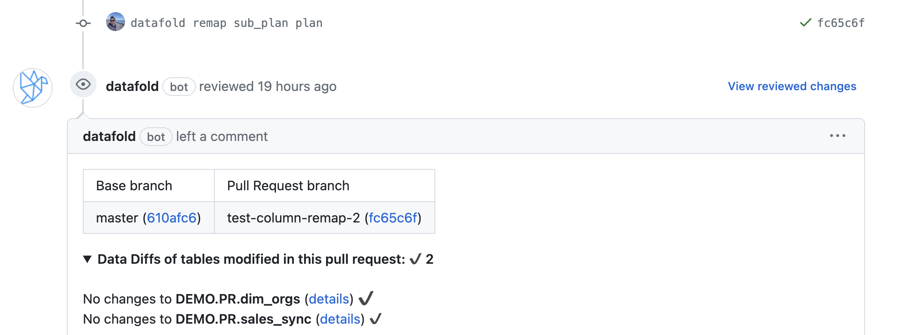
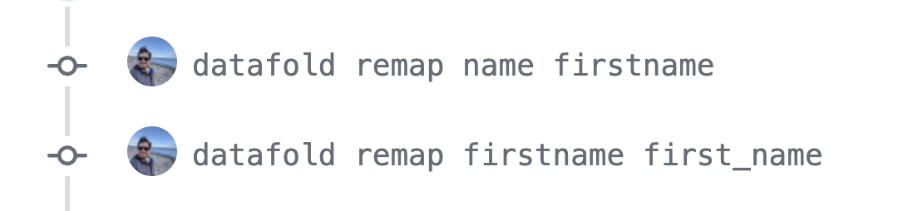

## Column Remapping

If your PR includes updates to column names, you can specify these updates in your git commit message using the following syntax. That way, Datafold will understand that the 
renamed column should be compared to the column in the production data with the original name.

By specifying column remapping in the commit message, when you rename a column, instead of thinking one column has been removed, and another has been added ... 




... Datafold will recognize that the column has been renamed:



Any of the following syntax styles can be added as a single 
line to a commit message to instruct Datafold in CI to remap a column from `oldcol` to `newcol`.


```
# All models/tables in the PR:
datafold remap oldcol newcol
X-Datafold: rename oldcol newcol
/datafold renamed oldcol newcol
datafold: remapped oldcol newcol

# Filtered models/tables by shell-like glob:
datafold remap oldcol newcol model_NAME
X-Datafold: rename oldcol newcol TaBLE
/datafold renamed oldcol newcol VIEW_*
```

### Chaining together column name updates
Commit messages can be chained together, so a commit message does not lock you in to 
renaming a column. For example, if your commit history looks like this ...



... Datafold will understand that the production column `name` has been 
renamed in the PR branch to `first_name`.
