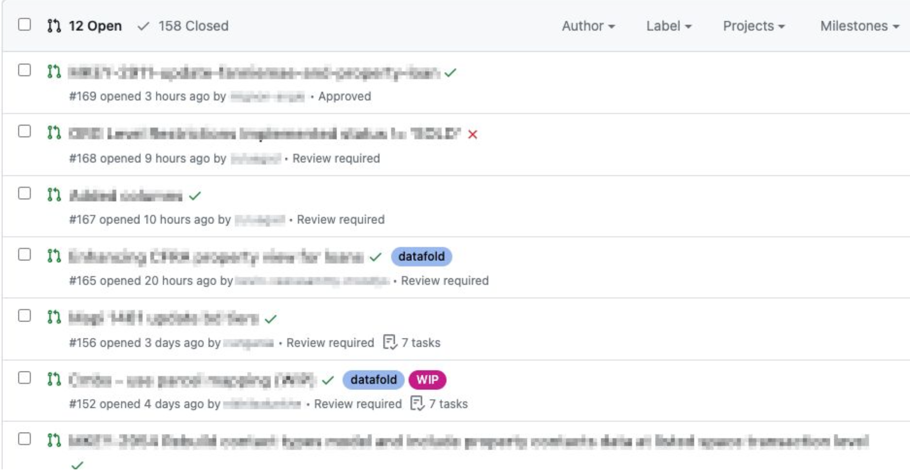

### Running data diff for specific PRs/MRs

By default, Datafold CI will run on every new pull/merge request and new commit to an existing pull/merge requests. To **only** run Datafold CI when the user explicitly requests it, you can set **Run only when tagged** option in the the Datafold app [CI settings](https://app.datafold.com/settings/integrations/ci)  which will only allow Datafold CI to run if a `datafold` tag/label is assigned to the pull/merge request.



### Running data diff on specific file changes

By default, Datafold CI will run on any file change in the repo. To skip Datafold CI runs for certain modified files (e.g. if the dbt code is placed in the same repo with non-dbt code), you can specify files to ignore. The pattern uses the syntax of .gitignore. Excluded files can be re-included by using the negation.

**Example**

Let's say the dbt project is a folder in a repo that contains other code (e.g. Airflow). We want to run Datafold CI for changes to dbt models but skip it for other files.
For that, we exclude all files in the repo except those the /dbt folder. We also want to filter out `.md` files in the /dbt folder:

```gitignore
*!dbt/*dbt/*.md
```

:::tip skipping specific dbt models

To skip diffing individual dbt models in CI, use the [`never_diff`](deployment_testing/configuration/model-specific_ci_configuration#excluding-models) option in the Datafold dbt yaml config.

:::


<!-- TODO: ### Skipping data diff run for a commit -->
