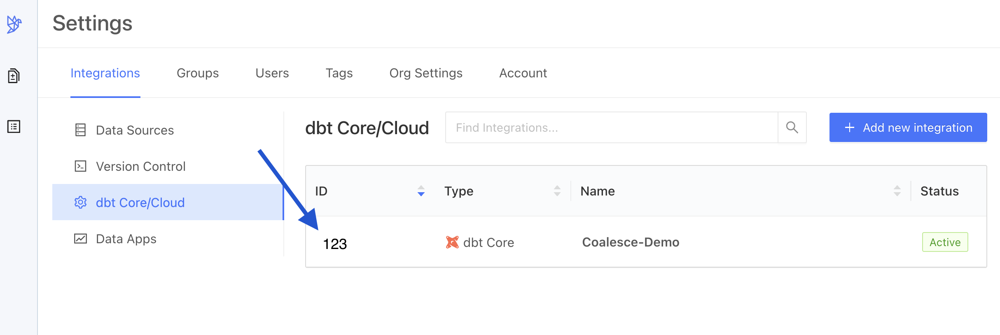

import Tabs from '@theme/Tabs';
import TabItem from '@theme/TabItem';

### Getting Started

To add Datafold to your CI using dbt Core:

#### 1. Create a dbt Core integration.


Complete the configuration by specifying the following fields:

| Field Name      | Description |
| ----------- | ----------- |
| Repository | Select your dbt project. |
| Data Source | Select the data source your dbt project writes to.|
| Name | Choose any name for your Datafold dbt integration. |
| Primary key tag | Choose a string for [tagging primary keys](/guides/dbt_advanced_configs#tag-primary-keys). |
| Import dbt tags and descriptions | Import dbt metadata (including column and table descriptions, tags, and owners) to Datafold. |
| Slim Diff | Data diffs will be run only for models changed in a pull request. See our [guide to Slim Diff](../../../../guides/slim_diff.md) for configuration options. |
| Diff Hightouch Models | Run Data Diffs for Hightouch models affected by your PR. |
| CI fails on primary key issues | The existence of null or duplicate primary keys will cause CI to fail. |
| Pull Request Label | When this is selected, the Datafold CI process will only run when the 'datafold' label has been applied. |
| Branch commit selection strategy | Select "Latest" if your CI tool creates a merge commit (the default behavior for GitHub Actions). Choose "Merge base" if CI is run against the PR branch head (the default behavior for GitLab). |
| Files to ignore | If defined, the files matching the pattern will be ignored in the PRs. The pattern uses the syntax of .gitignore. Excluded files can be re-included by using the negation; re-included files can be later re-excluded again to narrow down the filter. For example, to exclude everything except the `/dbt` folder, but not the dbt `.md` files, do:`*!dbt/*dbt/*.md`. |
| Sampling tolerance | The tolerance to apply in sampling for all data diffs. |
| Sampling confidence | The confidence to apply when sampling. |
| Sampling Threshold | Sampling will be disabled automatically if tables are smaller than specified threshold. If unspecified, default values will be used depending on the Data Source type. |

#### 2. Obtain the CI config ID of your dbt Core integration.


#### 3. Obtain an Datafold API Key.


#### 4. Using the Datafold SDK, configure your CI script(s) to upload dbt `manifest.json` files.

Datafold determines wich dbt models to diff in a CI run by comparing two `manifest.json` files generated by your production branch and your PR branch.

The following command will be incorporated into your CI script(s). 

```
datafold dbt upload --ci-config-id <your-ci_config-id> --run-type <job-type> --commit-sha <commit-sha>
```

Implementation details vary depending on [which CI tool](#ci-implementation-tools) you use. Please review the following instructions and examples for your organization's CI tool.

### CI Implementation Tools

We've created guides and templates for three popular CI tools.

:::tip Having trouble setting up Datafold in CI?
 👋 We're here to help! Please [reach out and chat with a Datafold Solutions Engineer](https://calendly.com/d/2t5-zxy-7ks/datafold-meet-with-leo-sung). ☎️
:::


To add Datafold to your CI tool, add `datafold dbt upload` steps in two CI jobs:

- **Upload Production Artifacts:** A CI job that build a production `manifest.json`. _This can be either your Production Job or a special Artifacts Job (explained below)._
- **Upload Pull Request Artifacts:** A CI job that builds a PR `manifest.json`.

This ensures Datafold always has the necessary `manifest.json` files, enabling us to run data diffs comparing production data to dev data.

<Tabs>
  <TabItem value="gha" label="GitHub Actions" default>

**Upload Production Artifacts**

Add the `datafold dbt upload` step to _either_ your Production Job _or_ an Artifacts Job.

_Production Job_

If your dbt prod job kicks off on merges to main/master, you can simply add a `datafold dbt upload` step after the `dbt build` step.
```yml
name: Production Job

on:
  push: # Run the job on push to the main branch
    branches:
      - main
      
jobs:
  run:
    runs-on: ubuntu-20.04 # your image will vary

    steps:

      - name: Install Datafold SDK
        run: pip install -q datafold-sdk
    # ...
      - name: Upload dbt artifacts to Datafold
        run: datafold dbt upload --ci-config-id <datafold_ci_config_id> --run-type production --commit-sha ${GIT_SHA}
        env:
          DATAFOLD_API_KEY: ${{ secrets.DATAFOLD_API_KEY }}
          GIT_SHA: "${{ github.sha }}"
```

_Artifacts Job_

Alternatively, if your dbt prod job does _not_ run on merges to main/master and only runs on a schedule, we recommend creating an additional dedicated job that runs on merges to main/master. 

The Artifacts Job's entire purpose is generating and uploading a `manifest.json` file to Datafold to represent the state of your dbt project's production branch.

This is the basic structure of an Artifacts Job:

```yml
name: Artifacts Job

on:
  push: # Run the job on push to the main branch
    branches:
      - main
      
jobs:
  run:
    runs-on: ubuntu-20.04 # your image will vary

    steps:
      
      # You should include the same or (similar steps) that exist in your production job, such as:
      #   - Checkout your code base
      #   - Install Python
      #   - Install any additional requirements

      - name: Install Datafold SDK
        run: pip install -q datafold-sdk

      - name: Generate dbt manifest.json
        run: dbt ls # or dbt compile

      - name: Upload dbt artifacts to Datafold
        run: datafold dbt upload --ci-config-id <datafold_ci_config_id> --run-type production --commit-sha ${GIT_SHA}
        env:
          DATAFOLD_APIKEY: ${{ secrets.DATAFOLD_APIKEY }}
          GIT_SHA: "${{ github.sha }}"
```

**Upload Pull Request Artifacts**

The `datafold dbt upload` step also needs to be added to the CI job that builds PR data.

:::tip dbt in CI
🔧 If you don't have a CI job that builds PR data, we can help you set this up. Please check out this [step-by-step blog post](https://www.datafold.com/blog/accelerating-dbt-core-ci-cd-with-github-actions-a-step-by-step-guide), or [book time to chat with a Datafold Solutions Engineer](https://calendly.com/d/2t5-zxy-7ks/datafold-meet-with-leo-sung). ☎️
:::

_Pull Request Job_

If you already have a Pull Request Job, adding the `datafold dbt upload` step is easy! Simply add the `datafold dbt upload` step to after the `dbt build` step.

```yml
name: Pull Request Job

# Run this job when a commit is pushed to any branch except main
on:
  pull_request:
  push:
    branches:
      - '!main'
      
jobs:
  run:
    runs-on: ubuntu-20.04 # your image will vary

    steps:
      
      - name: Install Datafold SDK
        run: pip install -q datafold-sdk

      - name: Upload PR manifest.json to Datafold
        run: |
          datafold dbt upload --ci-config-id <datafold_ci_config_id> --run-type pull_request --commit-sha ${GIT_SHA}
        # The <datafold_ci_config_id> value can be obtained from the Datafold application: Settings > Integrations > dbt Core/Cloud > the ID column
        env:
          DATAFOLD_API_KEY: ${{ secrets.DATAFOLD_API_KEY }}
          GIT_SHA: "${{ github.event.pull_request.head.sha }}"

```

Be sure to replace `<datafold_ci_config_id>` with the value you obtained in [this step](#2-obtain-the-ci-config-id-of-your-dbt-core-integration).

**Store your Datafold API Key**

Finally, store [your Datafold API Key](#3-obtain-an-datafold-api-key) as a secret named `DATAFOLD_API_KEY` [in your GitHub repository settings](https://docs.github.com/en/actions/security-guides/encrypted-secrets#creating-encrypted-secrets-for-a-repository).


Once you've completed these steps, Datafold will run data diffs between production and development data on the next GitHub Actions CI run.

  </TabItem>

  <TabItem value="circleci" label="CircleCI">

**Upload Production Artifacts**

Add the `datafold dbt upload` step to _either_ your Production Job _or_ an Artifacts Job.

_Production Job_

If your dbt prod job kicks off on merges to main/master, you can simply add a `datafold dbt upload` step after the `dbt build` step.

```yml
version: 2.1

jobs:
  prod-job:
    filters:
      branches:
        only: main # or master, or the name of your default branch
    docker:
      - image: cimg/python:3.9 # your image will vary

    steps:
      - checkout
      - run:
          name: "Install Datafold SDK"
          command: pip install -q datafold-sdk

      - run:
          name: "Build dbt project"
          command: dbt build

      - run:
          name: "Upload production manifest.json to Datafold"
          command: |
            datafold dbt upload --ci-config-id <datafold_ci_config_id> --run-type production --target-folder ./target/ --commit-sha ${CIRCLE_SHA1}
          # The <datafold_ci_config_id> value can be obtained from the Datafold application: Settings > Integrations > dbt Core/Cloud > the ID column
```

_Artifacts Job_

Alternatively, if your dbt prod job does _not_ run on merges to main/master and only runs on a schedule, we recommend creating an additional dedicated job that runs on merges to main/master. 

The Artifacts Job's entire purpose is generating and uploading a `manifest.json` file to Datafold to represent the state of your dbt project's production branch.

This is the basic structure of an Artifacts Job:


```yml
version: 2.1

jobs:
  artifacts-job:
    filters:
      branches:
        only: main # or master, or the name of your default branch
    docker:
      - image: cimg/python:3.9 # your image will vary
    steps:
      - checkout
      - run:
          name: "Install Datafold SDK"
          command: pip install -q datafold-sdk


      - run:
          name: "Generate manifest.json"
          command: dbt ls --profiles-dir ./

      - run:
          name: "Upload production manifest.json to Datafold"
          command: datafold dbt upload --ci-config-id <datafold_ci_config_id> --run-type production --target-folder ./target/ --commit-sha ${CIRCLE_SHA1}
          # The <datafold_ci_config_id> value can be obtained from the Datafold application: Settings > Integrations > dbt Core/Cloud > the ID column
```

**Upload Pull Request Artifacts**

The `datafold dbt upload` step also needs to be added to the CI job that builds PR data.

:::tip dbt in CI
🔧 If you don't have a CI job that builds PR data, we can help you set this up. Please check out this [step-by-step blog post](https://www.datafold.com/blog/accelerating-dbt-core-ci-cd-with-github-actions-a-step-by-step-guide), or [book time to chat with a Datafold Solutions Engineer](https://calendly.com/d/2t5-zxy-7ks/datafold-meet-with-leo-sung). ☎️
:::

_Pull Request Job_

If you already have a Pull Request Job, adding the `datafold dbt upload` step is easy! Simply add the `datafold dbt upload` step to after the `dbt build` step.

```yml
version: 2.1

jobs:
  pull-request-job:
    filters:
      branches:
        ignore: main # or master, or the name of your default branch
    docker:
      - image: cimg/python:3.9 # your image will vary
    steps:
      - checkout
      - run:
          name: "Install Datafold SDK"
          command: pip install -q datafold-sdk

      - run:
          name: "Generate manifest.json"
          command: dbt build 

      - run:
          name: "Upload pull_request manifest.json to Datafold"
          command: datafold dbt upload --ci-config-id <datafold_ci_config_id> --run-type pull_request --target-folder ./target/ --commit-sha ${CIRCLE_SHA1}
          # The <datafold_ci_config_id> value can be obtained from the Datafold application: Settings > Integrations > dbt Core/Cloud > the ID column
```

Be sure to replace `<datafold_ci_config_id>` with the value you obtained in [this step](#2-obtain-the-ci-config-id-of-your-dbt-core-integration).

**"Only build pull requests" setting**
[Enable "Only build pull requests"](https://circleci.com/docs/oss#only-build-pull-requests) in CircleCI. This ensures that CI runs on pull requests and production, but not on pushes to other branches.

**Store your Datafold API Key**
Finally, store [your Datafold API Key](#3-obtain-an-datafold-api-key) as a secret named `DATAFOLD_API_KEY` [in the CircleCI interface](https://circleci.com/docs/set-environment-variable/).

Once you've completed these steps, Datafold will run data diffs between production and development data on the next CircleCI run.
  </TabItem>

  <TabItem value="gitlab-ci" label="GitLab CI">

**Upload Production Artifacts**

Add the `datafold dbt upload` step to _either_ your Production Job _or_ an Artifacts Job.

_Production Job_

If your dbt prod job kicks off on merges to main/master, you can simply add a `datafold dbt upload` command to the `script` config after the `dbt build` step:

```yml
image:
  name: ghcr.io/dbt-labs/dbt-core:1.x # your name will vary
  entrypoint: [ "" ]

run_pipeline:
  stage: deploy
  before_script:
    - pip install -q datafold-sdk

  script:
    # Build your dbt models
    - dbt build --profiles-dir ./ # Your exact dbt invocation may vary.

    # Upload the `manifest.json` to Datafold
    - datafold dbt upload --ci-config-id <ci-config-id> --run-type production --commit-sha $CI_COMMIT_SHA
    # The <datafold_ci_config_id> value can be obtained from the Datafold application: Settings > Integrations > dbt Core/Cloud > the ID column
```

_Artifacts Job_

Alternatively, if your dbt prod job does _not_ run on merges to main/master and only runs on a schedule, we recommend creating an additional dedicated job that runs on merges to main/master. 

The Artifacts Job's entire purpose is generating and uploading a `manifest.json` file to Datafold to represent the state of your dbt project's production branch.

This is the basic structure of an Artifacts Job:


```yml
image:
  name: ghcr.io/dbt-labs/dbt-core:1.x # your name will vary
  entrypoint: [ "" ]

run_pipeline:
  stage: deploy
  before_script:
    - pip install -q datafold-sdk

  script:
    # Generate manifest.json
    - dbt ls --profiles-dir ./ 

    # Upload the `manifest.json` to Datafold
    - datafold dbt upload --ci-config-id <ci-config-id> --run-type production --commit-sha $CI_COMMIT_SHA
    # The <datafold_ci_config_id> value can be obtained from the Datafold application: Settings > Integrations > dbt Core/Cloud > the ID column
```

**Upload Pull Request Artifacts**

The `datafold dbt upload` step also needs to be added to the CI job that builds PR data.

:::tip dbt in CI
🔧 If you don't have a CI job that builds PR data, we can help you set this up. Please check out this [step-by-step blog post](https://www.datafold.com/blog/accelerating-dbt-core-ci-cd-with-github-actions-a-step-by-step-guide), or [book time to chat with a Datafold Solutions Engineer](https://calendly.com/d/2t5-zxy-7ks/datafold-meet-with-leo-sung). ☎️
:::

_Pull Request Job_

If you already have a Pull Request Job, adding the `datafold dbt upload` step is easy! Simply add the `datafold dbt upload` step to after the `dbt build` step.

```yml
image:
  name: ghcr.io/dbt-labs/dbt-core:1.x # your name will vary
  entrypoint: [ "" ]

run_pipeline:
  stage: test
  before_script:
    - pip install -q datafold-sdk

  script:
    # Generate manifest.json
    - dbt build --profiles-dir ./ 

    # Upload the `manifest.json` to Datafold
    - datafold dbt upload --ci-config-id <ci-config-id> --run-type production --commit-sha $CI_COMMIT_SHA
    # The <datafold_ci_config_id> value can be obtained from the Datafold application: Settings > Integrations > dbt Core/Cloud > the ID column
 rules:
    - if: '$CI_PIPELINE_SOURCE == "merge_request_event"'
```

Be sure to replace `<datafold_ci_config_id>` with the value you obtained in [this step](#2-obtain-the-ci-config-id-of-your-dbt-core-integration).

**Store your Datafold API Key**

Finally, store [your Datafold API Key](#3-obtain-an-datafold-api-key) as a secret named `DATAFOLD_API_KEY` [in your GitLab repository settings](https://docs.gitlab.com/ee/ci/yaml/index.html#secrets).

Once you've completed these steps, Datafold will run data diffs between production and development data on the next GitLab CI run.

  </TabItem>

</Tabs>

### Optional CI Configurations and Strategies

#### Including `datafold-skip-ci` in the git commit message

* If the last commit contains the string `datafold-skip-ci`, the Datafold step in CI will be skipped.
