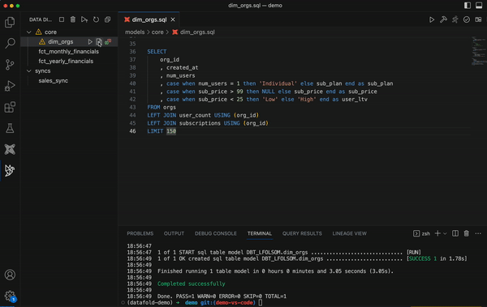
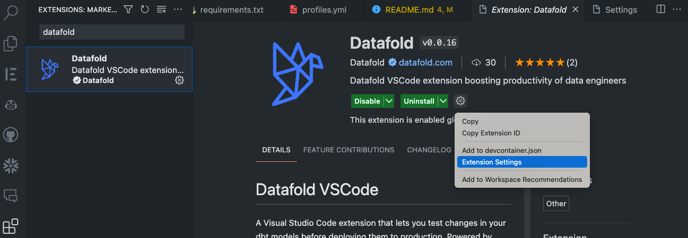
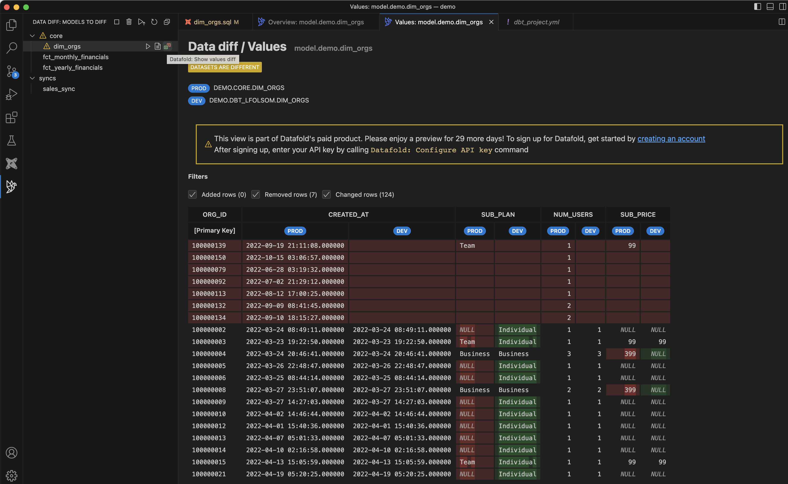
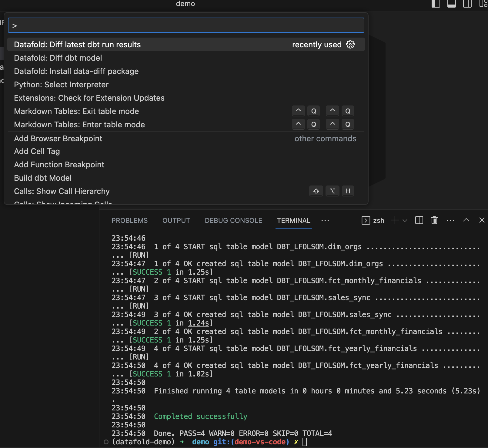
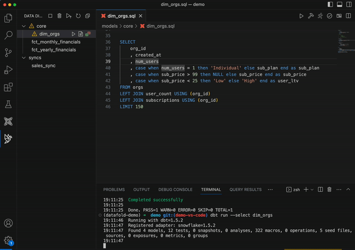

With the [Datafold VS Code Extension](https://marketplace.visualstudio.com/items?itemName=Datafold.datafold-vscode), you can quickly run and diff any dbt models, view and interact with diff results in a clean GUI, and automatically diff models that change all within your VS Code IDE.



## Installation

1. Install the [Datafold VS Code Extension](https://marketplace.visualstudio.com/items?itemName=Datafold.datafold-vscode) using the VS Code Extension tab.


2. Open up the extension's settings to set file paths for dbt profiles, your dbt project, and your Python installation.



:::tip

Set absolute paths in the Extension Settings to avoid any issues.

:::

3. Using the command palate (⌘⇧P on Mac, ⌃⇧P on Windows and Linux), install `data-diff` by searching for "Datafold: Install data-diff". 


- You'll be walked through a few steps including:
  - setting up your `dbt_project.yml`
  - setting the path to your `profiles.yml`
  - selecting a data warehouse
- **If you use custom schemas**, just enter any text string in the "Enter your schema" step. This will populate the `production_schema`
  `var` in your `dbt_project.yml` with whatever value you entered. Then, you'll need to adjust your `dbt_project.yml`
  following the steps in the Custom Schema section in [our documentation](/development_testing/cli).

This is what will be added to the `vars` of your `dbt_project.yml` once setup is complete:

```
vars:
  data_diff:
    prod_database: YOUR_DATABASE
    prod_schema: YOUR_SCHEMA
```

## Getting started

### Running your first Data Diff

You can diff dbt models by clicking on the bird of Datafold, which reveals a sidebar containing all of your dbt models.


Click on any model's "play" button to run a data diff between the development and production version of the model.

:::tip

In order for the data diff to run, there must be a version of the model in both your production and development environments.

:::


### Explore value-level differences

Understand exactly which values will change if the development code is merged to production.



### Additional commands

You can search for Datafold commands by using the command palate (⌘⇧P on Mac, ⌃⇧P on Windows and Linux). 

Try typing "Datafold: Diff dbt model"

:::tip 

- If a dbt model file is open, it will be diffed automatically.
- If a dbt model file is not open, you will be prompted to enter a model name.

:::


You can also diff every model that was built in your most recent `dbt run`.




## Additional features

### Watch Mode

By turning on Watch Mode, the Datafold VS Code extension will diff all models that are run in each `dbt run`, as you code. Simply check this box in the Extension Settings.


:::tip 

To prevent diffing too many models with Watch Mode on, be sure to select only a subset (e.g., `dbt run --select dim_orgs+`).

:::


