With the Datafold VS Code Extension, you can quickly run and diff any dbt models, view and interact with diff results in a clean GUI, and automatically diff models that change all within your VS Code IDE.

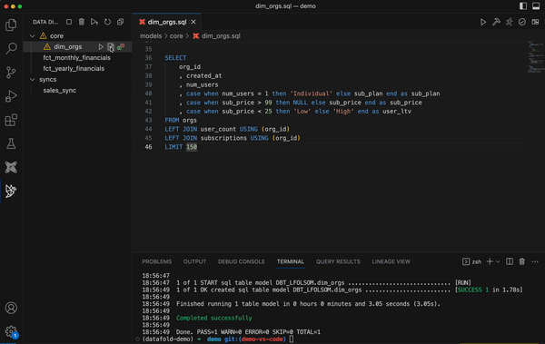

## Installation

1. Install the Extension using the VS Code Extension tab.

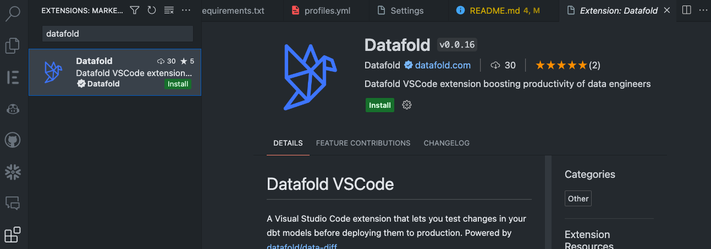

2. Open up the extension's settings to set file paths for dbt profiles, your dbt project, and your Python installation.

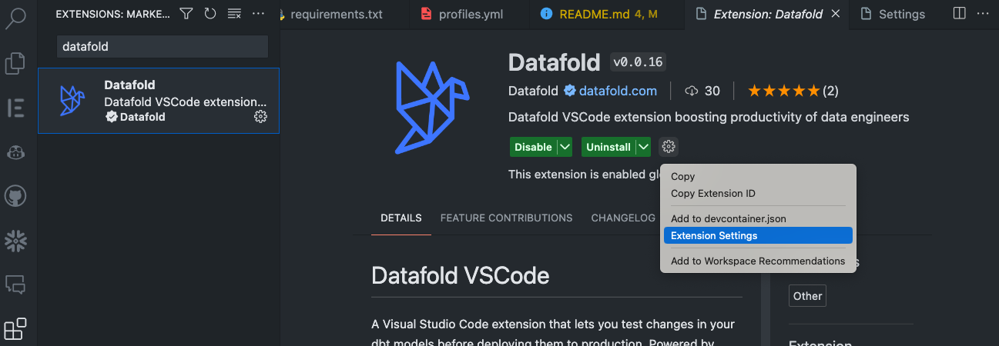

:::tip

Set absolute paths in the Extension Settings to avoid any issues.

:::

3. Using the command palate (⌘⇧P on Mac, ⌃⇧P on Windows and Linux), install `data-diff` by searching for "Datafold: Install data-diff". 

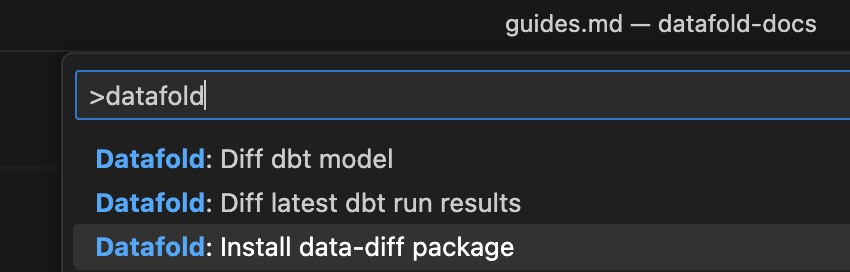

- You'll be walked through a few steps including:
  - setting up your `dbt_project.yml`
  - setting the path to your `profiles.yml`
  - selecting a data warehouse
- **If you use custom schemas**, just enter any text string in the "Enter your schema" step. This will populate the `production_schema`
  `var` in your `dbt_project.yml` with whatever value you entered. Then, you'll need to adjust your `dbt_project.yml`
  following the steps in the Custom Schema section in [our documentation](../development_testing/open_source/).

This is what will be added to the `vars` of your `dbt_project.yml` once setup is complete:

```
vars:
  data_diff:
    prod_database: YOUR_DATABASE
    prod_schema: YOUR_SCHEMA
```

## Getting started

### Running your first Data Diff

You can diff dbt models by clicking on the bird of Datafold, which reveals a sidebar containing all of your dbt models.

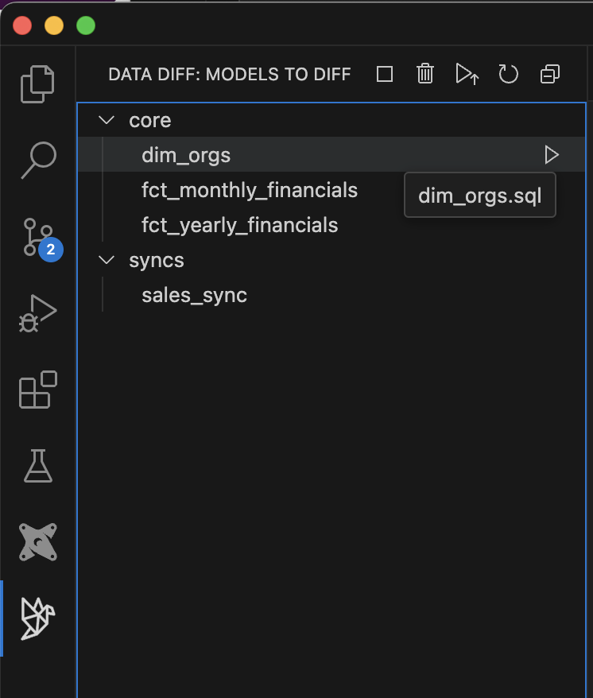

Click on any model's "play" button to run a data diff between the development and production version of the model.

:::tip

In order for the data diff to run, there must be a version of the model in both your production and development environments.

:::

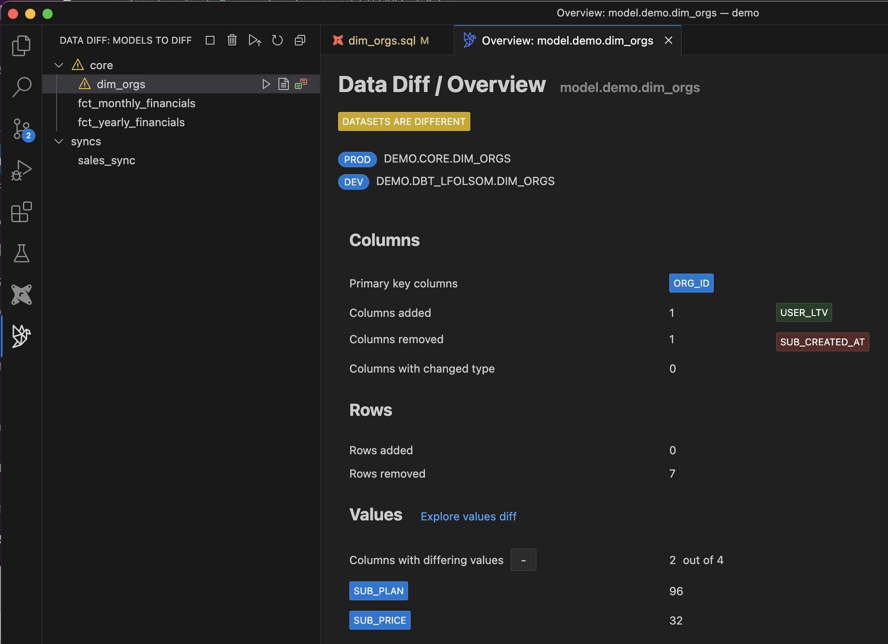

### Explore value-level differences

Understand exactly which values will change if the development code is merged to production.

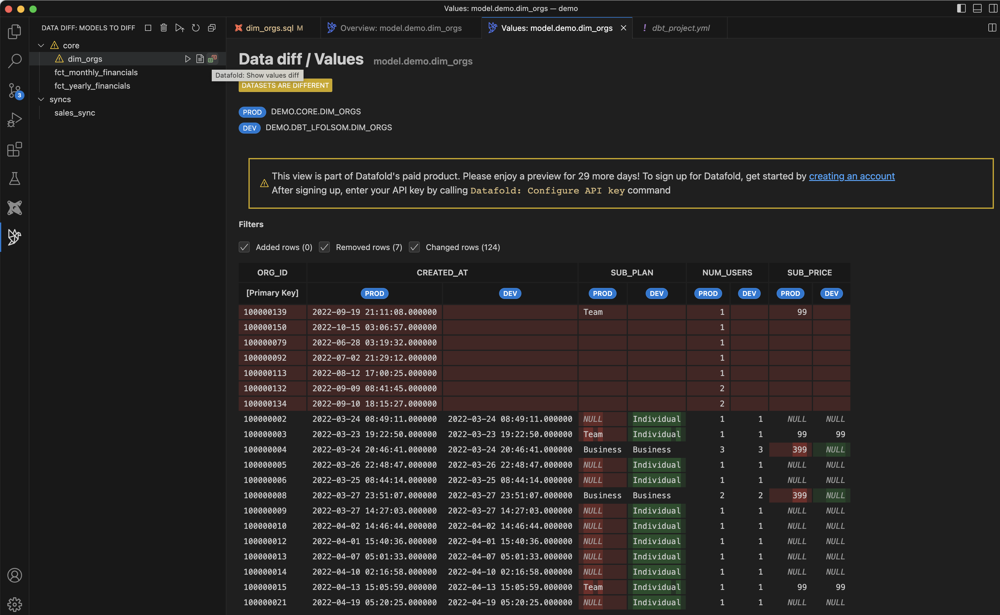

### Additional commands

You can search for Datafold commands by using the command palate (⌘⇧P on Mac, ⌃⇧P on Windows and Linux). 

Try typing "Datafold: Diff dbt model"

:::tip 

- If a dbt model file is open, it will be diffed automatically.
- If a dbt model file is not open, you will be prompted to enter a model name.

:::

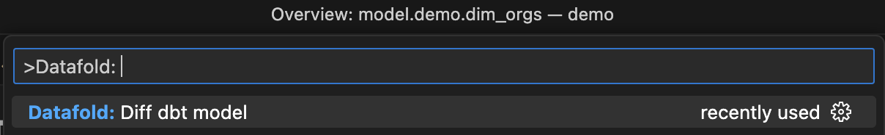

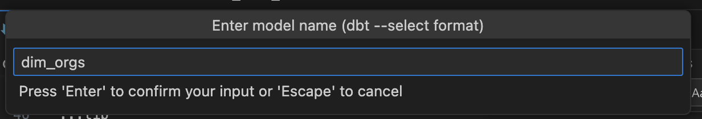

You can also diff every model that was built in your most recent `dbt run`.

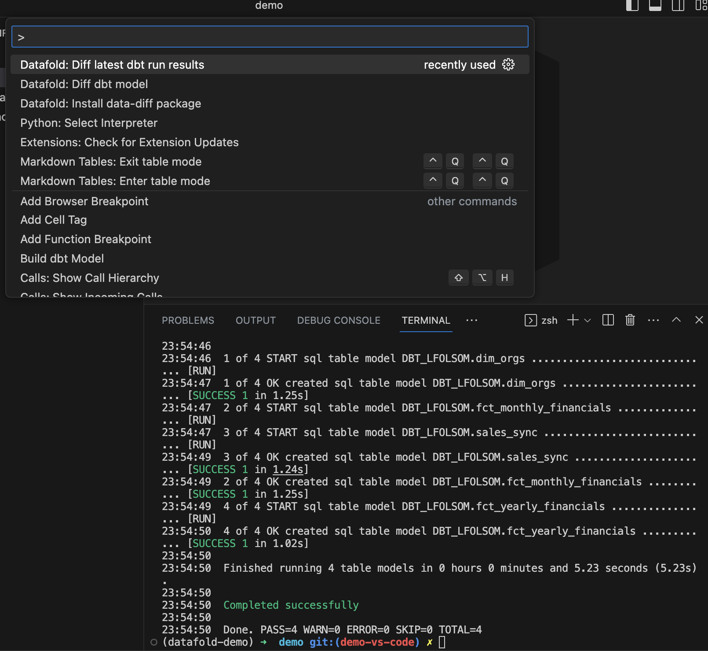


## Additional features

### Watch Mode

By turning on Watch Mode, the Datafold VS Code extension will diff all models that are run in each `dbt run`, as you code. Simply check this box in the Extension Settings.

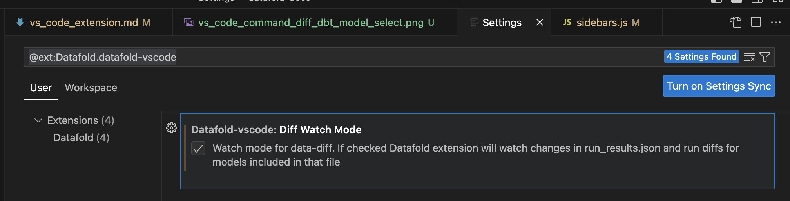

:::tip 

To prevent diffing too many models with Watch Mode on, be sure to select only a subset (e.g., `dbt run --select dim_orgs+`).

:::


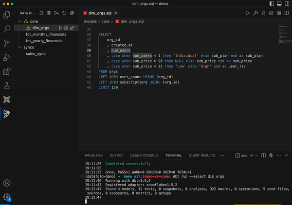